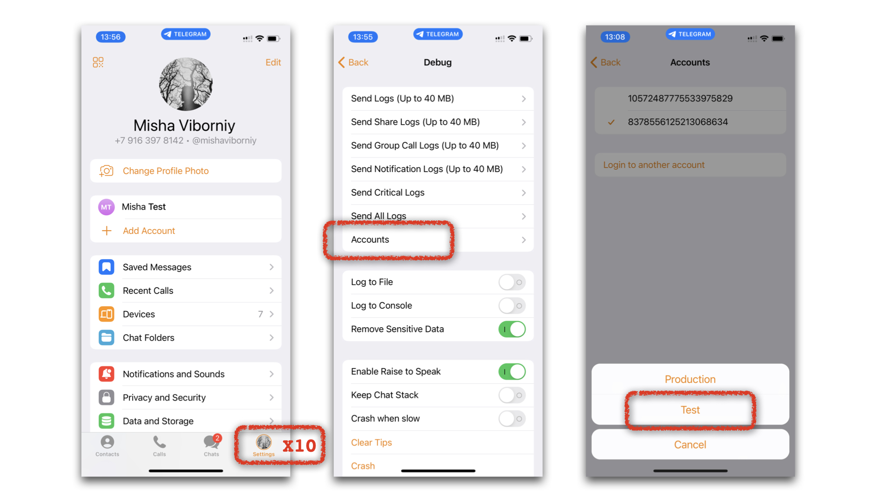

# Как реализовать E2E тестирование телеграм бота

# Вступление

Все кто писали телеграм ботов, рано или поздно задавались вопросом, как их тестировать. На этот вопрос сложно ответить однозначно. К примеру, при написании тестов для веб-приложений и API, можно воспользоваться тестовым клиентом ([DRF](https://www.django-rest-framework.org/api-guide/testing/) или [FastAPI](https://fastapi.tiangolo.com/tutorial/testing/)) ты просто пишешь запрос и делаешь `assert` на полученный ответ. Мне захотелось получить подобный функционал и для тестирования Телеграм бота.

Здесь я хочу рассказать вам о своем опыте напасания **автоматизированных** end-to-end тестов, без эмуляции Telegram Bot API и с использованием тестовых аккаунтов. Мы зайдем в изолированное [тестовое](https://core.telegram.org/bots/features#testing-your-bot) пространство Телеграм, создадим тестового бота, подготовим фикстуру для запуска нашего приложения и напишем авторизацию для тестовых клиентов.

По ходу статьи будут использоваться инструменты следующих библиотек.
- [Python Telegram Bot](https://github.com/python-telegram-bot/python-telegram-bot) - для написания бота (сокращенно `PTB`)
- [Pytest](https://github.com/pytest-dev/pytest) - для организации тестов
- [Anyio](https://github.com/agronholm/anyio) для асинхронных тестов и фикстур
- [Pyrogram](https://github.com/pyrogram/pyrogram) - для отправки тестовых сообщений

Статья написана на примере рализации несложного бота для хранения фотографий и отправки их в ответ при запросе. Вы можете посмотреть исходный код приложения и тестов на [GitHub](https://github.com/MishaVyb/bart-bot).

# Альтеранативы

Перед тем, как писать что-то самому, я пытался найти готовое решения. Еще не окунувшись в проблематику сполна, я был уверен получить ответ по первой же ссылке в гугле. Но оказывается, оптимального готового решения нету. Я кратко перечислю здесь все, что мне удалось найти и почему это мне не подошло.
#### [PTB Test](https://github.com/python-telegram-bot/ptbtest)
- больше не поддерживается
- интеграция с `unittest` (не `pytest`)

[Aiogram Tests](https://github.com/OCCCAS/aiogram_tests)
- подходит для тестирования ботов написанных только на `aiogram`
- реализует *unit* тестирование через Mock объекты (без интеграции Telegram Bot API)

Все тест кейсы описываются, как вызов конкретных `handler`-ов, из-за чего нет возможности протестировать все поведения целиком (от отправки пользователем сообщения до получения ответа). К примеру, не понятно, как тестировать фильтрацию входящих сообщений и их распределение по различным `handler`-ам и тп.

#### [Tg Integration](https://github.com/JosXa/tgintegration/)
- так же не поддерживается
- тянет устаревшие зависимости (`pyrogram` < 2.0.0 `typing-extensions` < 4.0.0)
- практически отсутствует документация

# Перед тем как начать. Регистрация APP

Предположим, наш бот уже написан и мы переходим к тестированию. Мы подготовим все инструменты для того, чтобы написание самих тестов было кратким и понятным. Отправить сообщение, получить ответ, проверить его.

Отправлять тестовые сообщения мы будем с помощью `Pyrogram`. Для этого нужно [зарегистрировать](https://my.telegram.org/apps) будущее клиентское приложение.

📍 Тут важно понимать, что для взаимодействия с Telegram API **необходимо** зарегистрировать свое приложение в системе [Телеграм](https://core.telegram.org/api/obtaining_api_id) и для этого понадобиться **действительный** номер телефона. Но для запуска самих тестов будут использоваться тестовые телефонные номера. Так что переживать за сохранность личных данных или получение *флуд-бана* не стоит.

После регистрации мы получаем `api_key` и `api_id`, которые можем использовать для создания множества клиентских приложений.
> The API key defines a token for a Telegram _application_ you are going to build. This means that you are able to authorize multiple users or bots with a single API key.

# Тестовый Бот
## Регистрация бота.
Для тестирования пользовательских приложений Телеграм дает доступ к `Dedicated test environment`  (Выделенная тестовая среда). Это изолированная песочница, где можно так же регистрировать пользователей и создавать ботов. Если аккаунты мы будем создавать динамически, используя тестовые номера, то зарегистрировать тестового бота у `@BotFather` проще вручную используя свой настоящий номер.

> The test environment is **completely separate** from the main environment, so you will need to create a new user account and a new bot with [@BotFather](https://t.me/botfather).

Как это сделать, можно прочитать [тут](https://core.telegram.org/bots/features#testing-your-bot). Я использовал приложение Телеграм для `iOS`, кликнув 10 раз на иконку `Settings` (`Настройки`).



Далее, как обычно, регистрируем бота у `@BotFather` и получаем токен. Для обращения к любому из методов, нужно добавить `/test/` в путь запроса.

```
https://api.telegram.org/bot<token>/test/METHOD_NAME
```

## Запуск бота во время тестов.
Теперь, при запуске тестов, мы можем запустить наше приложение в *тестовом* пространстве. Для этого подготовим фикстуру.

```python
@pytest.fixture(scope='session') # fixture runs Bot app only once for entire tess session
async def application():
	app = Application.builder().token('<token>' + '/test').build()

	await app.initialize()
	await app.post_init(app) # initialize does *not* call `post_init` - that is only done by run_polling/webhook
	await app.start()
	await app.updater.start_polling()

	yield app

	await app.updater.stop()
	await app.stop()
	await app.shutdown()
```

Обычно для запуска приложения мы используем `app.run_polling()`, но это *заблокирует* дальнейшее исполнение программы. Мы же будем запускать тесты в *параллель* с тем, как работает наш бот. Подробнее о том, как запускать `PTB` с другим асинхронным кодом: [Running PTB alongside other asyncio frameworks](https://github.com/python-telegram-bot/python-telegram-bot/wiki/Frequently-requested-design-patterns#running-ptb-alongside-other-asyncio-frameworks)

📍 `pytest` сам по себе не асинхронный, но может работать с асинхронными тестами и факстурами, если добавить `pytestmark = pytest.mark.anyio`. Подробнее: [Testing with AnyIO](https://anyio.readthedocs.io/en/stable/testing.html#testing-with-anyio "Permalink to this heading")

📍`PTB` на данный момент [не поддерживает](https://github.com/python-telegram-bot/python-telegram-bot/issues/3355) работу бота в тестовом пространстве, но можно передать токен вместе с приставкой `/test`. Класс `telegram.Bot` формирует базовый путь сложением `base_url` и `token`.
```python
# content of /telegram/_bot.py
self._base_url: str = base_url + self._token
self._base_file_url: str = base_file_url + self._token
```

## Перехватывание исключений
По умолчанию, все необработанные исключение в `PTB` пишутся в лог. Но при запуске тестов, мы хотим убедиться, что в приложении не возникало никаких ошибок. Для этого добавим обрабоботчик ошибок, где будем сохранять возникшие исключение в отдельное место (в моем случае это переменная класса). Позже мы сможем проверить на наличие непредвиденных исключений.
```python
async def collect_app_exceptions_callback(self, update: Update, context: ContextTypes.DEFAULT_TYPE):
    self.collected_exception = context.error
    self.collection_event.set()     # special asyncio event we are wating for while collecting replyes
    raise ApplicationHandlerStop  # prevent any other error handlers

app.add_error_handler(self.collect_app_exceptions_callback)
```

📍 `collection_event` специальный объект класса `asyncio.Event`. Это событие, исполнение которого мы ожидаем, пока ждем ответа от бота. Вы увидите его применение в следующем блоке.

Отлично, наш бот работает, теперь можем отправлять ему тестовые сообщения. Для этого понадобится аккаунт.

# Тестовый Клиент Аккаунт
## Тестовые номера
Для тестирования приложения мы будем использовать тестовые номера, которые [предоставляет](https://core.telegram.org/api/auth#test-accounts) Телеграм. Мы можем сформировать тестовые номера заранее и хранить их, к примеру в .`env` файле или генерировать их на лету для каждой тест сессии отдельно. Тестовый номер:
```
99966XYYYY
X - номер номер DC от 1 до 3
Y - любой случайный номер
```

Тестовый номер позволит в автоматическом режиме проходить авторизацию и мы можем создать сколь угодно много аккаунтов. К примеру мой бот позваляет давать другим людям доступ к общей базе фотографий. Так я смогу протестировать, что один клиент загрузил фото, другой получил к ней доступ, а третий нет.

📍Телеграм переодически сбрасывает тестовые номера, поэтому все дальнейшие действия по авторизации и настройки телеграм клиента лучше производить непосредственно перед каждом запуском тестов.

> Do not store any important or private information in the messages of such test accounts; anyone can make use of the simplified authorization mechanism – and we periodically wipe all information stored there.

## Создание клиента
Для упрощенной регистрации клиентов и перехватывания всех сообщений от бота **отдельно** для каждого клиента, я инкапсулировал всю логику в отдельный класс `ClientIntegration`. Но в примерах здесь, я удалил все опциональный настройки, чтобы не отвлекаться от сути. Вы можете посмотреть циликом код вспомогательного класса [тут](https://github.com/MishaVyb/bart-bot/blob/main/tests/tools/integration.py).

1. Создадим клиента. В отличие от `PTB`, у `Pyrogram` есть нативная [поддержка](https://docs.pyrogram.org/topics/test-servers) тестового пространства Телеграм.

```python
self.client = Client(
	'test-client',
	api_id='<api_id>',
	api_hash='<api_hash>',
	test_mode=True,
	in_memory=True,
	phone_number='99966' + '1' + '2023',
	phone_code='1' * 5,
)
```

- `in_memory` - после авторизации сессия не будет записываться файл `test-client.session`, а останется в памяти. Это нужно, чтобы изолировать тесты друг от друга.
- `phone_code` - это код подтверждения авторизации. Для тестовых номеров всегда равен номеру DC х 5 раз.

2. Мы уже указали телефонный номер и код подтверждения. Но может быть такое, что тестовый номер **не зарегистрирован** вовсе. В этом случае `Pyrogram` попросит ввести имя и фамилию. Чтобы пройти процесс регистрации автоматически, заменим stdout и stdin
```python
@contextmanager
def patch_signup_inout(self):
	def mock_input_callback(prompt: str = ''):
		if 'Enter first name: ' == prompt:
			return '<first name>'
		if 'Enter last name (empty to skip): ' == prompt:
			return '<last name>'
		raise ValueError(prompt)

	def mock_print_callback(self, *args, **kwargs):
		...

	with pytest.MonkeyPatch.context() as monkeypatch:
		monkeypatch.setattr(builtins, 'input', mock_input_callback)
		monkeypatch.setattr(builtins, 'print', mock_print_callback)
		yield
```

3. Теперь мы можем запустить приложение клиента. Для удобства, я описал все действия в отдельном методе `ClientIntegration` и обернул его в [asynccontextmanager](https://docs.python.org/3/library/contextlib.html#contextlib.asynccontextmanager)

```python
@asynccontextmanager
async def session_context(self)
	...
	try:
		# Some phonenumbers are registered already, some other not.
		# To be sure, handle sign up action by patching stdin/stdout.
		with self.patch_signup_inout():
			await self.client.start()

		# Update Telegram User properties, if they are needed for tests cases.
		await self.client.update_profile('<first name>', '<last name>', '<bio>')
		if self.client.me.username != self.credits.username:
			await self.client.set_username('<username>')

		# Clear messages to make each test isolated from others.
		await client.invoke(
			DeleteHistory(peer=await client.resolve_peer('<bot name>'), max_id=0, just_clear=False)
		)

		yield self

	finally:
		await self.client.set_username(None) # cleaning up
		await self.client.stop()
```

📍 Если вы не знакомы со встроенной библиотекой `contexlib`, я советую посмотреть эту [статью](https://rednafi.github.io/digressions/python/2020/03/26/python-contextmanager.html#writing-context-managers-as-decorators) предварительно.
📍 Если для авторизации клиента использовать случайно сгенерированный тестовый номер, то стоить учесть, что другой разработчик мог установить 2-х фактурную авторизацию для этого номера, защитив его паролем. В таком случае остается только попробовать любой другой номер.

6. В итоге можем использовать `ClientIntegration.session_context` для описания фикстур.

```python
@pytest.fixture(scope='session')
async def integration_1():
	async with ClientIntegration().session_context() as integration_1:
		yield integration_1

@pytest.fixture(scope='session')
async def integration_2():
	async with ClientIntegration().session_context() as integration_2:
		yield integration_2

...
```

# Тестирование
## Сборщик Ответов
Для тестов надо будет отправлять сообщения боту и получать от него ответы. Если с первым все понятно, то для второго нужно повесить обработчик сообщений, где можно складывать все полученные сообщения в список, чтобы потом сделать `assert` на содержание полученных сообщений.

Но как долго нам ждать ответа от бота. Можно задать максимальное значение `timeout`, а можно указать конкретное количество, что к примеру мы ждем только 1 сообщение и как только оно будет получено, можно двигаться дальше.

```python
# messages collector:
async def collect_replyes_callback(self, client: Client, message: Message)
	self.collected_replyes.append(message)

	# If True, set event flag to True. No more waiting for messages:
	if len(self.collected_replyes) == self.collection_required_amount:
		self.collection_event.set()

# timeout checker:
async def collection_max_timeout_waiting(self, timeout: float):
	await sleep(timeout)
	self.collection_event.set()

...
self.client.on_message(filters.chat('<bot name>'))(self.collect_replyes_callback)
self.collection_event = asyncio.Event()

# Wait until all messages are received or reaching timeout.
timout_task = asyncio.create_task(self.collection_max_timeout_waiting(timeout))
await self.collection_event.wait()
timout_task.cansel()
```

Теперь мы можем проверить полученные сообщения и то, что в приложени не было никаких ошибок (мы вешали `error_handler` при инициализации приложения `PTB`).
```python
assert not self.collected_exceptions, 'Unhandled app exception received. '
assert len(self.collected_replyes) == amount, 'Received unexpected messages amount. '
```

Для удобства, я описал все эти действия в отдельном методе `ClientIntegration` и обернул его в `@asynccontextmanager`. При выходе из контекстного менеджера `collect` сработает блок `finally`, где мы будем ожидать ответов от бота.

```python
@asynccontextmanager
async def collect(self, *, amount: int, timeout: float = 2.0):
	self.collection_amount = amount
	self.collected_replyes.clear()
	self.collection_event = asyncio.Event()

	try:
		yield self.collected_replyes
	finally:
		timout_event = asyncio.create_task(self.collection_max_timeout_waiting(timeout))
		await self.collection_event.wait()
		timout_event.cancel()

		assert not self.collected_exceptions, 'Unhandled app exception received. '
		assert len(self.collected_replyes) == amount, 'Received unexpected messages amount. '
```
## Описание Тестов
К примеру, мы хотим протестировать отправку сообщения `/start` и получение на него ответа `Hello, {username}!`. Благодаря фикстурам, описанным выше, этот тест кейс может быть описан буквально тремя строчками.

```python
pytestmark = [
	pytest.mark.anyio,
	pytest.mark.usefixtures('application')  # PTB Application
]

async def test_start_handler(integration: ClientIntegration):
	# test action:
	async with integration.collect(amount=1) as replyes:
		await integration.client.send_message('<bot name>', '/start')
	# at __aexit__ wait until all messages are received

	# test assertion:
	assert replyes[0].text == f'Hellow, {username}!'

```

📍 Если вместо `Pyrogram` использовать `Telethon`, то вместо собственного сборщика сообщений, можно воспользоваться методом [conversation](https://docs.telethon.dev/en/stable/modules/custom.html?highlight=conversation#module-telethon.tl.custom.conversation). Подробнее можно посмотреть [тут](https://blog.1a23.com/2020/03/06/how-to-write-integration-tests-for-a-telegram-bot/).

```python
with client.conversation('<bot name>') as conv:
	await conv.send_message("/start")

	reply: Message = await conv.get_response()
	assert reply.raw_text == f'Hellow, {username}!'
```


# Заключение
На этом все. В наличии все необходимые инструменты для написания тестов *от начала и до конца*. Вы можете создать несколько пользователей, отправлять ими разные тестовые сообщения и проверять ответы.